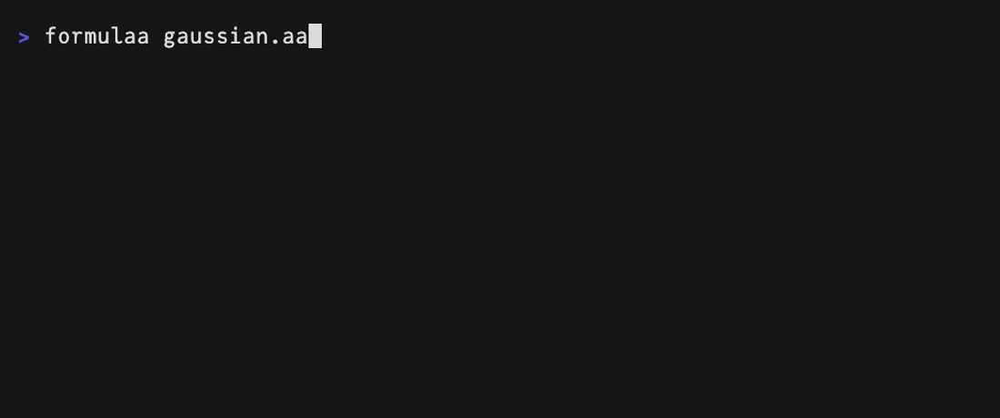

# formulAA

**Math as plain text you can actually edit.** formulAA is three pieces
that fit together:

- a **2D text format** for formulas — Unicode "ASCII art" that reads like
  typeset math, with a formal grammar ([docs/aa-spec.md](docs/aa-spec.md)):
  every picture has exactly one reading, and parses back to exactly the
  syntax tree that drew it;
- a **WYSIWYG structure editor** in the terminal, so drawing those
  pictures is no harder than typing a formula;
- **converters** to and from LaTeX, plus a formatter for hand-written
  input.


## A session

```sh
$ formulaa gauss.aa              # WYSIWYG editing in the terminal; ^W writes and quits
$ cat gauss.aa                   # the file is nothing but the picture
 ∞    -𝑥²   ┌─
┈∫┈┈ 𝑒   𝑑𝑥=√π
 -∞
$ formulaa --aa2latex gauss.aa   # …which a machine reads back exactly
\int_{-\infty }^{\infty }e^{-x^{2}}dx=\sqrt{\pi }
$ formulaa --aa2latex gauss.aa | formulaa --latex2aa   # and the loop closes
 ∞    -𝑥²   ┌─
┈∫┈┈ 𝑒   𝑑𝑥=√π
 -∞
```

No hidden markup generated that picture: `gauss.aa` *is* the source.
Keep it in a Markdown note, a comment, a commit message — anywhere plain
text goes — and convert it when a machine needs it.

## Why a picture as the source

Terminals, git, Markdown and prompts all run on plain text, and math is
the part that resists. The usual two options each give something up:
LaTeX is machine-readable but you have to picture
`\frac{-b\pm\sqrt{b^2-4ac}}{2a}` in your head; hand-drawn ASCII art
reads at a glance but nothing can interpret it.

Diagram tools settled this years ago by making the drawing itself the
single source of truth — [ditaa](https://github.com/stathissideris/ditaa)
(2004), [aafigure](https://pypi.org/project/aafigure/),
[ASCIIToSVG](https://github.com/dhobsd/asciitosvg),
[Markdeep](https://casual-effects.com/markdeep/) (2015),
[svgbob](https://github.com/ivanceras/svgbob),
[GoAT](https://github.com/blampe/goat): you keep the ASCII diagram in
your source file and the tool renders it. formulAA does that for math,
pointing at LaTeX rather than SVG.

## One picture, one reading

Those tools interpret free-form drawings as best they can — a sensible
choice for boxes and arrows, where a near miss is still a diagram. Math
cannot afford it: `a` above `b` is a fraction, a limit or a coincidence
of layout, and guessing wrong silently changes the meaning. So formulAA
does not accept drawings in general. It defines a format
([docs/aa-spec.md](docs/aa-spec.md), self-contained enough to write
another parser from) in which every accepted picture has exactly one
reading — [what makes a picture
parseable](#the-core-idea-what-makes-a-picture-parseable) below sketches
the ideas that buy that property.

Uniqueness has a price: a handful of **reserved structural glyphs** —
the fraction bar `─`, the operator band `┈`, delimiter columns `⎛ ⎜ ⎝`,
grid junctions `┼` — which can never be ordinary content, and which have
to line up. Typing that by hand, through a text editor's
one-dimensional cursor, would be miserable.

That is what the TUI is for: it edits the syntax tree and redraws the
picture, so the glyphs stay consistent and every edit is checked against
the round trip before it lands. Its input and output are still nothing
but plain-text AA — hand-edit it in vim, paste it into a document, or
have a language model write it ([`SKILL.md`](SKILL.md) teaches the
format).

Hand-written AA does not have to be canonical, either. Acceptance is
wider than the format's normal form, and `--format` closes the gap the
way `gofmt` does:

```sh
$ printf '   1\n─────────\n1 + x\n' | formulaa --format
   1
───────
 1 + 𝑥
```

## The editor

`formulaa formula.aa` opens the editor on a file — `^O` saves, `^W`
saves and quits, and a name that does not exist yet is simply where the
first save goes.

- Type naturally: letters become math italics, `//` makes a fraction,
  `^`/`_` open scripts, `(` `[` `{` auto-size, `\frac` `\sum` `\alpha`
  `\bbR` and friends via a `\` minibuffer with Tab completion (aliases
  included — `\leq`, `\rightarrow`, ASCII spellings like `\->` and
  `\oo` all work).
- Move *through* structure with the arrow keys; `↑`/`↓` enter limits and
  promote a bare `∑`/`lim` to its band form. Select with `Shift+←/→`,
  wrap the selection in `\frac`, `\sqrt`, parentheses, a norm…
- After every edit the editor re-parses its own output; an edit that
  would break the round trip is refused on the spot, and the message
  line says what failed.

Three keys make the difference on a formula that has grown past one
line.

### `^F` — the free cursor

Arrows move over the *picture*, not the tree; Enter lands on the
nearest edit position. Three wrong things in three corners of a normal
distribution, fixed without walking there:



It scales with the picture — here a Vandermonde determinant, where the
targets are two matrix entries and the product's condition:


### `^B` — block select

`^B` rings the structures around the cursor and `↑`/`↓` walk that ring,
so a whole subexpression goes to the clipboard by shape rather than by
counting characters. The DPO loss repeats the same policy ratio four
times: from the innermost `x` the ring grows one structure at a time —
the argument pair, the parens, the whole numerator — and `^F` flies to
the letters that must differ:


### `^G` — grid edit

Inside a matrix, `^G` gives a cell cursor; `c` and `r` switch to column
and row lanes, where Enter on a gap inserts one and Backspace on a lane
removes it. The plane rotation matrix becomes the rotation about the z
axis:


Key reference: [docs/keys.md](docs/keys.md) · command reference:
[docs/commands.md](docs/commands.md). Every demo above is a
[VHS](https://github.com/charmbracelet/vhs) tape in [`demo/`](demo) —
`vhs demo/free-move.tape` re-records it.

The same editor core compiles to WebAssembly; prototype integrations for
VS Code and Obsidian live in their own repositories
([formulaa-vscode](https://github.com/ho-oto/formulaa-vscode),
[formulaa-obsidian](https://github.com/ho-oto/formulaa-obsidian)); Zed is
CLI-task based (see the roadmap in [docs/adr.md](docs/adr.md)).

## The core idea: what makes a picture parseable

The format is designed backwards from the parser — four rules turn a
drawing into a grammar:

1. **Every subexpression owns a rectangle and a baseline row.** Siblings
   sit side by side in disjoint column ranges; vertical structure exists
   only inside a rectangle. Parsing is: find the baseline, scan it left
   to right, recurse into the rectangles that structural glyphs claim.

2. **Structure is drawn with reserved glyphs that can never be atoms.**
   The fraction bar `─`, the operator band `┈`, delimiter columns
   `⎛ ⎜ ⎝`, the radical `√` and its overline — these characters are
   banned from ordinary content, so their appearance is always a
   structural claim, never a coincidence. Conversely, atoms come from an
   allow-list (every character is exactly one cell wide), so a stray
   wide or combining character cannot silently shear the grid.

3. **Extent is spanned, never counted.** A fraction bar is wider than
   both its arguments; a `┈` band sandwiches the operator and spans its
   limits; a brace's vertex sits on the baseline row. No rule ever
   depends on *how many* spaces separate two things — whitespace only
   separates siblings, which is exactly what makes hand-editing
   survivable.

4. **One canonical spelling per tree.** The renderer's output is the
   normal form; the parser accepts a superset (lenient ASCII input,
   plain letters for math italics) and `--format` closes the loop. Ambiguity
   that cannot be drawn cannot be represented: e.g. accents stack as
   flat lists, because the picture cannot distinguish
   `\hat{\underline{x}}` from `\underline{\hat{x}}`.

The result: a formula is a picture *and* a syntax tree at all times.

## Examples

All of these are taken from the round-trip test corpus
([more here](docs/examples.md)) — each parses back to its exact tree and
converts to the LaTeX shown.

The quadratic formula:

```plain
      ┌──────
   -𝑏±√𝑏²-4𝑎𝑐
𝑥=────────────
       2𝑎
```

```latex
x=\frac{-b\pm \sqrt{b^{2}-4ac}}{2a}
```

Cauchy–Schwarz:

```plain
⎛  𝑛     _ ⎞    ⎛  𝑛      ⎞ ⎛  𝑛      ⎞
⎜┈┈∑┈┈ 𝑢ₖ𝑣ₖ⎟² ≤ ⎜┈┈∑┈┈ 𝑢ₖ²⎟ ⎜┈┈∑┈┈ 𝑣ₖ²⎟
⎝ 𝑘=1      ⎠    ⎝ 𝑘=1     ⎠ ⎝ 𝑘=1     ⎠
```

```latex
\left(\sum_{k=1}^{n}u_{k}\bar{v}_{k}\right)^{2}\le \left(\sum_{k=1}^{n}u_{k}^{2}\right)\left(\sum_{k=1}^{n}v_{k}^{2}\right)
```

A Vandermonde determinant — matrices are grids with explicit lattice
markers, so rows and columns are unambiguous even with empty cells:

```plain
⎡ 1   𝑥₁   𝑥₁²   ⋯   𝑥₁ⁿ⁻¹ ⎤
⎢   ┼    ┼     ┼   ┼       ⎥
⎢ 1   𝑥₂   𝑥₂²   ⋯   𝑥₂ⁿ⁻¹ ⎥
⎢   ┼    ┼     ┼   ┼       ⎥ = ┈┈┈┈∏┈┈┈┈ (𝑥ⱼ-𝑥ᵢ)
⎢ ⋮   ⋮     ⋮    ⋱     ⋮   ⎥    1≤𝑖<𝑗≤𝑛
⎢   ┼    ┼     ┼   ┼       ⎥
⎣ 1   𝑥ₙ   𝑥ₙ²   ⋯   𝑥ₙⁿ⁻¹ ⎦
```

## CLI

```sh
formulaa formula.aa            # edit a formula file (^O saves, ^W saves and quits,
                               #   ^Y copies the AA; a missing file is created)
cat formula.aa | formulaa -    # …or take it from stdin
formulaa --aa2latex formula.aa # AA → LaTeX (stdin works too)
formulaa --latex2aa formula.tex # LaTeX → AA, best effort (KaTeX/MathJax dialect)
formulaa --format formula.aa   # normalize hand-written AA to canonical form
```

LaTeX round-trips: everything `--aa2latex` emits reads back to the exact
same tree, and `\latex` in the editor opens a box you can paste LaTeX
into (unknown commands are skipped, never an error).

## For AI agents

Because the format is plain text with a strict grammar, language models
can read and write it directly. [`SKILL.md`](SKILL.md) is a
self-contained guide that teaches an agent the format, including the
verification loop (`formulaa --format` to check, `formulaa --aa2latex` to confirm the
meaning) — useful for embedding re-editable math in Markdown documents
that both humans and agents maintain.

MIT licensed.
