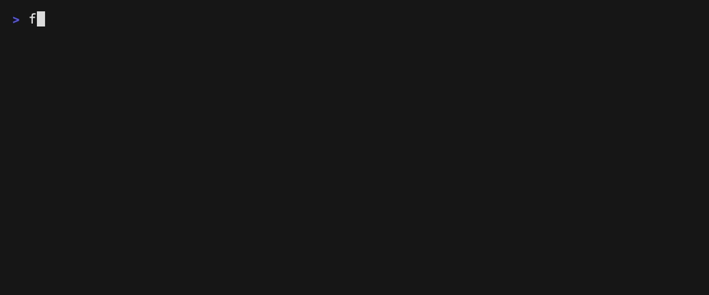
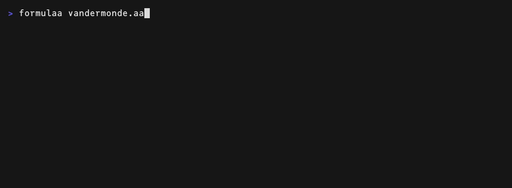
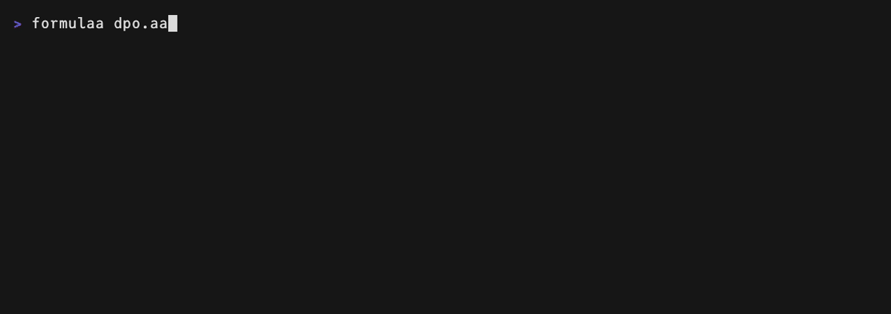
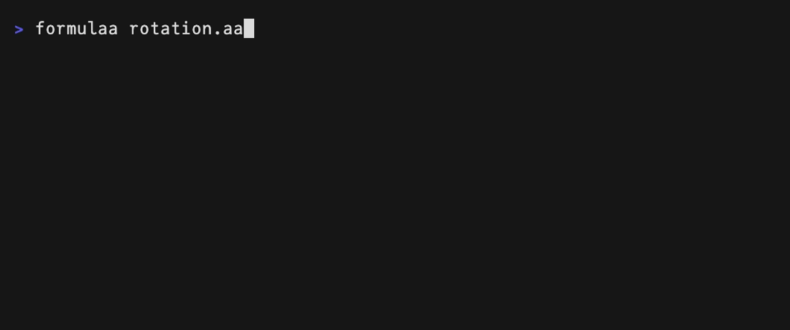

# formulAA

**Math as plain text you can actually edit.** Three pieces:

- a **2D text format** for formulas — Unicode "ASCII art" with a formal
  grammar ([docs/aa-spec.md](docs/aa-spec.md)): every picture has exactly
  one reading, and parses back to the tree that drew it;
- a **WYSIWYG structure editor** in the terminal for writing it;
- **converters** to and from LaTeX, and a formatter.



```sh
$ formulaa gauss.aa              # edit it in the terminal; ^W writes and quits
$ cat gauss.aa                   # the file holds nothing but the picture
 ∞    -𝑥²   ┌─
┈∫┈┈ 𝑒   𝑑𝑥=√π
 -∞
$ formulaa --aa2latex gauss.aa   # a machine reads it back exactly
\int_{-\infty }^{\infty }e^{-x^{2}}dx=\sqrt{\pi }
$ formulaa --aa2latex gauss.aa | formulaa --latex2aa   # and back again
 ∞    -𝑥²   ┌─
┈∫┈┈ 𝑒   𝑑𝑥=√π
 -∞
```

There is no markup behind the picture — the picture is the source. Keep
it wherever plain text goes, and convert it when a machine needs it.

## Why a picture as the source

Terminals, git, Markdown and prompts run on plain text; math is the part
that resists. LaTeX is machine-readable but you have to picture
`\frac{-b\pm\sqrt{b^2-4ac}}{2a}` in your head. ASCII art reads at a
glance but nothing can interpret it.

Diagram tools take the drawing itself as the source and render it from
there — [ditaa](https://github.com/stathissideris/ditaa)
(2004), [aafigure](https://pypi.org/project/aafigure/),
[ASCIIToSVG](https://github.com/dhobsd/asciitosvg),
[Markdeep](https://casual-effects.com/markdeep/) (2015),
[svgbob](https://github.com/ivanceras/svgbob),
[GoAT](https://github.com/blampe/goat). formulAA does the same for
math, with LaTeX as the output instead of SVG.

## One picture, one reading

Those tools read free-form drawings as best they can. That is fine for
boxes and arrows, where a near miss is still a diagram, but math cannot
work that way: `a` above `b` is a fraction, a limit, or a coincidence of
layout, and a wrong guess changes the meaning silently.

So formulAA does not accept drawings in general. It defines a format
([docs/aa-spec.md](docs/aa-spec.md), self-contained enough to write
another parser from) where every accepted picture has exactly one
reading; the rules are summarized in [what makes a picture
parseable](#the-core-idea-what-makes-a-picture-parseable) below.

The cost is a handful of **reserved structural glyphs** — the fraction
bar `─`, the operator band `┈`, delimiter columns `⎛ ⎜ ⎝`, grid junctions
`┼` — which are never ordinary content and have to line up. That is what
the TUI is for: it edits the tree and redraws the picture, so you never
place those glyphs yourself. Input and output are still plain
text, so you can hand-edit the file in vim, paste it into a document, or
have a language model write it ([`SKILL.md`](SKILL.md) teaches the
format).

## The editor

`formulaa formula.aa` opens the editor on a file; `^O` saves and `^W`
saves and quits.

- Type naturally: letters become math italics, `//` makes a fraction,
  `^`/`_` open scripts, `(` `[` `{` auto-size, and a `\` minibuffer with
  Tab completion covers the rest (`\frac`, `\sum`, `\alpha`, `\bbR`,
  aliases like `\->` and `\oo`).
- Arrows move *through* structure; `↑`/`↓` enter limits. `Shift+←/→`
  selects, and a structure key wraps the selection.

Three keys matter once a formula grows past one line.

### `^F` — the free cursor

Arrows move over the *picture*, not the tree; Enter lands on the nearest
edit position. Two entries of a Vandermonde determinant and the
product's condition, fixed without walking there:



### `^B` — block select

`^B` rings the structures around the cursor and `↑`/`↓` walk it, so a
subexpression is copied by shape, not by counting characters. The DPO
loss repeats the same policy ratio four times: from the innermost `x`
the ring grows one structure at a time — the argument pair, the parens,
the whole numerator — and `^F` flies to the letters that must differ:



### `^G` — grid edit

Inside a matrix, `^G` gives a cell cursor; `c` and `r` switch to column
and row lanes, where Enter on a gap inserts one and Backspace on a lane
removes it. A plane rotation becomes a rotation about the z axis:



Keys: [docs/keys.md](docs/keys.md) · commands:
[docs/commands.md](docs/commands.md). Every demo is a
[VHS](https://github.com/charmbracelet/vhs) tape in [`demo/`](demo).

The editor core compiles to WebAssembly; prototype
[VS Code](https://github.com/ho-oto/formulaa-vscode) and
[Obsidian](https://github.com/ho-oto/formulaa-obsidian) integrations
live in their own repositories.

## The core idea: what makes a picture parseable

The format is designed backwards from the parser — four rules turn a
drawing into a grammar:

1. **Every subexpression owns a rectangle and a baseline row.** Siblings
   sit in disjoint column ranges; vertical structure exists only inside
   a rectangle. Parsing is: find the baseline, scan left to right,
   recurse into the rectangles that structural glyphs claim.

2. **Structure is drawn with glyphs that can never be atoms.** The bar
   `─`, the band `┈`, delimiter columns `⎛ ⎜ ⎝`, the radical `√` — banned
   from content, so their appearance is always a structural claim. Atoms
   come from an allow-list of one-cell characters, so a stray wide or
   combining character cannot shear the grid.

3. **Extent is spanned, never counted.** A bar is wider than both its
   arguments; a band sandwiches its operator. No rule depends on *how
   many* spaces separate two things, so hand-editing cannot break the
   picture by shifting something sideways.

4. **One canonical spelling per tree.** The renderer's output is the
   normal form and the parser accepts a superset. Ambiguity that cannot
   be drawn cannot be represented: accents stack as flat lists, because
   the picture cannot tell `\hat{\underline{x}}` from
   `\underline{\hat{x}}`.

A formula is a picture *and* a syntax tree at all times.

## Examples

From the round-trip corpus ([more examples](docs/examples.md)) — each parses back
to its exact tree and converts to the LaTeX shown.

The quadratic formula:

```plain
      ┌──────
   -𝑏±√𝑏²-4𝑎𝑐
𝑥=────────────
       2𝑎
```

```latex
x=\frac{-b\pm \sqrt{b^{2}-4ac}}{2a}
```

Cauchy–Schwarz:

```plain
⎛  𝑛     _ ⎞    ⎛  𝑛      ⎞ ⎛  𝑛      ⎞
⎜┈┈∑┈┈ 𝑢ₖ𝑣ₖ⎟² ≤ ⎜┈┈∑┈┈ 𝑢ₖ²⎟ ⎜┈┈∑┈┈ 𝑣ₖ²⎟
⎝ 𝑘=1      ⎠    ⎝ 𝑘=1     ⎠ ⎝ 𝑘=1     ⎠
```

```latex
\left(\sum_{k=1}^{n}u_{k}\bar{v}_{k}\right)^{2}\le \left(\sum_{k=1}^{n}u_{k}^{2}\right)\left(\sum_{k=1}^{n}v_{k}^{2}\right)
```

A Vandermonde determinant — grids carry explicit lattice markers, so
rows and columns stay unambiguous even with empty cells:

```plain
⎡ 1   𝑥₁   𝑥₁²   ⋯   𝑥₁ⁿ⁻¹ ⎤
⎢   ┼    ┼     ┼   ┼       ⎥
⎢ 1   𝑥₂   𝑥₂²   ⋯   𝑥₂ⁿ⁻¹ ⎥
⎢   ┼    ┼     ┼   ┼       ⎥ = ┈┈┈┈∏┈┈┈┈ (𝑥ⱼ-𝑥ᵢ)
⎢ ⋮   ⋮     ⋮    ⋱     ⋮   ⎥    1≤𝑖<𝑗≤𝑛
⎢   ┼    ┼     ┼   ┼       ⎥
⎣ 1   𝑥ₙ   𝑥ₙ²   ⋯   𝑥ₙⁿ⁻¹ ⎦
```

## CLI

```sh
formulaa formula.aa            # edit a formula file (^O saves, ^W saves and quits,
                               #   ^Y copies the AA; a missing file is created)
cat formula.aa | formulaa -    # …or take it from stdin
formulaa --aa2latex formula.aa # AA → LaTeX (stdin works too)
formulaa --latex2aa formula.tex # LaTeX → AA, best effort (KaTeX/MathJax dialect)
formulaa --format formula.aa   # normalize hand-written AA to canonical form
```

Everything `--aa2latex` emits reads back to the same tree, and `\latex`
in the editor opens a box to paste LaTeX into (unknown commands are
skipped, never an error).

## Fonts

The format leans on Unicode math symbols — mathematical alphanumerics
(`𝑥`, `𝒟`, `𝔼`), big operators, bracket pieces, box drawing — which most
coding fonts cover only in part.
[JuliaMono](https://juliamono.netlify.app/) has all of them at a
monospace width and is the recommended font for the editor;
[`tools/merge_math_font.py`](tools/merge_math_font.py) ports just those
glyphs into another coding font if you would rather keep yours.

## For AI agents

Plain text with a strict grammar is something a language model can write
directly. [`SKILL.md`](SKILL.md) is a self-contained guide to the format
plus its verification loop (`--format` to check, `--aa2latex` to confirm
the meaning) — for embedding re-editable math in documents that humans
and agents both maintain.

MIT licensed.
